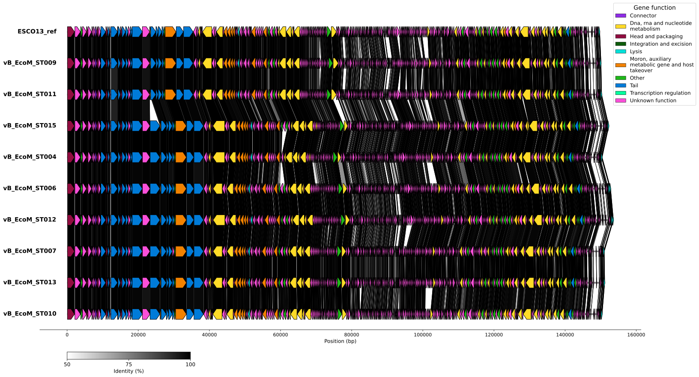

# GenALLYgn - Genes alignement and visualisation tool   
<div style="display" flex; justify-content: space-between; align="center">

  
</div>

*<div align="center">
    By Ally Champoux, Université de Sherbrooke, 20/08/2024*
</div>

<div align="center">
  
<a href="https://www.gnu.org/software/bash/"></a>
<a href="https://www.python.org/"></a>

</div>
  <p>
    <strong>This repository contains scripts used to align and visualise small DNA fragments such as phages genomes.</strong>
  </p>


## Installation 
You first have to clone this repository
```bash
git clone https://github.com/allychamp/Phage_alignement_visualisation.git

```
It contains the following tree: 
```bash
├── Image
├── LICENSE
├── README.md
├── config.yaml
└── src
    ├── __init__.py
    ├── blast_links.py
    ├── main.py
    ├── parser.py
    └── plotter.py
```


Note that you should have [conda](https://docs.conda.io/projects/conda/en/latest/user-guide/install/index.html) or [miniconda](https://docs.anaconda.com/miniconda/) installed to run this pipeline. 

The dependencies can be installed with the yaml file in this repo. This will create a conda environnement containning all the dependencies. To do so, run this command: 
```bash
conda env create -f genALLYgn_env.yml
```
## Usage
The tool takes in input a combination of a genbank file and a protein fasta file per sample (one folder per file type)
Before launching the script, first complete the config file: 
| Variable in config file | Description |
|---|---|
| `genomes_dir` | Path to a folder containing all GenBank files |
| `faa_dir` | Path to a folder containing all protein FASTA files |
| `all_proteins` | Path to the directory where the merged multi-FASTA protein file should be saved |
| `blast_file` | Path (including filename) to the directory where the all-vs-all BLAST results file should be saved |
| `cds_table` | Path to the summary CSV of all CDS predictions (used for color-coding functions in the visualization) |
| `color_table` | Path to the CSV mapping each function to its desired color (used for color-coding functions in the visualization) |
| `output_svg` | Path (including file extension) for the desired output file |
| `blast.identity_threshold` | Minimum percent identity required between query and subject proteins for a link to be kept (e.g. 30 = at least 30% identity) |
| `blast.coverage_threshold` | Minimum percent of the query protein length that must align with the subject for a link to be kept (e.g. 60 = at least 60% coverage) |
| `blast.num_threads` | Number of threads to use for the BLAST analysis; more threads speeds up the run |
| `plot.spacing` | Spacing between genomes in the plot |
| `plot.label_width` | Width of the genome labels in the plot |
| `plot.genome_order` | Order in which genomes should appear (must match the genome file names) if not specifie, genomes will be order by similarity |

Once all the paths are set up, activate your conda environnemnt:
```bash
conda activate genALLYgn_env
```

Then, go in the directory containning the scripts and run the following command:
```bash
python -m src.main
```
## Citation 
Please keep an eye open for the preprint of this tool. In the meantime, please cite this repository if you use it in your work:
Champoux, A., Jacques, P., & Fortier, L. (2026). GeneALLYgn [Computer software]. https://github.com/allychamp/phage-genome-analysis-pipeline
